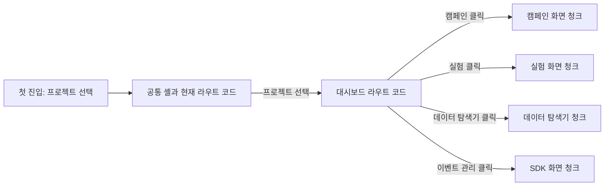

# 대시보드 초기 로딩 코드 분할

## 한눈에 보는 결과

사용자가 첫 화면에서 아직 열지 않은 대시보드 기능까지 내려받던 구조를 라우트와 탭 경계로 분리했다. 로컬 Docker에서 Vite production build를 Nginx로 제공하고 Lighthouse Desktop을 10회씩 독립 실행한 결과, 중앙값 기준 초기 전송량은 56.0%, FCP는 48.5%, LCP는 34.9% 감소했다.

| 지표                      | 변경 전 | 변경 후 |             변화 |
| ------------------------- | ------: | ------: | ---------------: |
| Performance score         |    66.5 |    83.0 |          +16.5점 |
| FCP                       | 2,166ms | 1,116ms | -1,050ms, -48.5% |
| LCP                       | 2,400ms | 1,563ms |   -837ms, -34.9% |
| Speed Index               | 2,166ms | 1,116ms | -1,050ms, -48.5% |
| 초기 전송량               |  2.46MB |  1.08MB |  -1.37MB, -56.0% |
| 미사용 JavaScript 추정량  |  1.59MB |  0.30MB |  -1.29MB, -81.0% |
| 메인 스레드 작업          |   271ms |   195ms |    -76ms, -27.9% |
| JavaScript 실행 준비 시간 |   109ms |    89ms |    -20ms, -18.3% |

이 수치는 배포 서비스의 실제 사용자 데이터가 아니라, 같은 컴퓨터와 같은 로컬 Docker 환경에서 얻은 합성 실험 결과다. 따라서 이력서와 포트폴리오에는 반드시 `Docker 기반 production build`, `Lighthouse Desktop`, `10회 중앙값`을 함께 적는다.

## 왜 이 작업이 필요했나

변경 전 Vite 설정은 TanStack Router의 자동 코드 분할을 명시적으로 끄고 있었다. 또한 공통 대시보드 렌더러와 `$tabPath` 라우트가 캠페인, 실험, 통계, 데이터 탐색기, SDK 화면을 정적 import하고 있었다.

그 결과 사용자가 프로젝트 선택 화면(`/`)만 보고 있어도 아직 방문하지 않은 대시보드 화면 코드가 메인 JavaScript에 포함됐다.

- 변경 전 메인 JavaScript: 2,209,720B
- Lighthouse가 추정한 초기 미사용 JavaScript: 중앙값 1,593,725B
- 변경 전 Desktop LCP: 중앙값 2.40초
- 프로덕션 빌드에서 500KB를 넘는 청크 경고 발생

  2.40초는 그 자체로 심각하게 느린 수치라고 과장할 수 없다. web.dev가 안내하는 좋은 LCP 기준인 2.5초 이하의 경계 안에 있기 때문이다. 다만 초기 화면에서 사용하지 않는 JavaScript가 1.59MB로 확인됐고, 이미 라우트·탭이라는 명확한 로딩 경계와 Suspense 로딩 UI가 있어 작은 변경으로 낭비를 줄일 수 있었다. 즉, 이 작업의 핵심 당위성은 단순히 점수를 높이는 것이 아니라 **현재 화면에 필요하지 않은 코드를 먼저 내려받는 구조적 낭비를 제거하는 것**이다.

참고 자료:

- [TanStack Router code splitting](https://tanstack.com/router/latest/docs/guide/code-splitting)
- [web.dev LCP 설명과 2.5초 기준](https://web.dev/articles/lcp)
- [Lighthouse performance scoring](https://developer.chrome.com/docs/lighthouse/performance/performance-scoring)

## 무엇을 바꿨나

### 1. 라우트 단위 자동 코드 분할

`vite.config.ts`의 `autoCodeSplitting`을 활성화했다. TanStack Router가 현재 라우트 렌더링에 필요하지 않은 컴포넌트를 별도 청크로 생성한다.

- 커밋: `1696422 feat: 라우트 단위 코드 분할 적용`
- 변경 파일: `apps/web-client/vite.config.ts`

라우트 분할만 적용했을 때 초기 메인 청크는 약 627KB로 줄었지만, 공통 `$tabPath` 라우트 청크에는 여러 대시보드 탭이 함께 들어가 약 1,065KB가 남았다. 파일 라우트 하나 아래에서 여러 탭을 조건부 렌더링하는 구조이므로 라우터의 자동 분할만으로는 탭 경계까지 알 수 없었다.

### 2. 대시보드 탭 단위 지연 로딩

`React.lazy`와 동적 import를 사용해 상위 메뉴와 하위 워크플로 화면을 사용 시점에 불러오도록 분리했다.

- 상위 메뉴: 실험, 데이터 탐색기, 이벤트 관리
- 캠페인 워크플로: 캠페인 관리, 성과, 프로모션, 고객군, 실험 관리
- 기타: 메인, 퍼널
- 커밋: `6179573 feat: 대시보드 탭별 코드 지연 로딩`
- 변경 파일:
  - `apps/web-client/src/routes/dashboard.$projectId.$tabPath.tsx`
  - `apps/web-client/src/features/dashboard/ui/DashboardRenderer.tsx`

기존 라우트 경계가 `wrapInSuspense: true`와 `LoadingState`를 제공하므로 지연 청크를 받는 동안 빈 화면이 아니라 기존 로딩 화면이 표시된다.



이 작업은 API 호출 순서나 서버 데이터 모델을 바꾼 것이 아니다. **화면을 실행하는 JavaScript를 언제 내려받을지**만 바꿨다.

## 번들 구조 변화

측정에 사용한 Docker 이미지 안의 비압축 파일 크기다.

| 항목                    |     변경 전 |  변경 후 |
| ----------------------- | ----------: | -------: |
| 메인 JavaScript         |  2,209,720B | 627,974B |
| `$tabPath` 제어 청크    | 메인에 포함 |   9,299B |
| 캠페인 관리 진입 청크   | 메인에 포함 |  68,226B |
| 실험 진입 청크          | 메인에 포함 | 104,739B |
| 데이터 탐색기 진입 청크 | 메인에 포함 |  52,932B |
| 이벤트 관리 진입 청크   | 메인에 포함 |  83,151B |

메인 JavaScript는 1,581,746B, 즉 71.6% 감소했다. 위 탭 파일 크기는 해당 화면의 **진입 청크** 크기이며, 공유 의존성까지 포함한 메뉴별 전체 전송량을 뜻하지는 않는다.

`CreativeHtmlCodeEditor` 약 567KB 등 큰 기능 청크도 남아 있다. 그러나 현재는 첫 화면에서 분리돼 있으므로, 실제 해당 기능의 진입 지연이 측정되기 전까지 추가 분할이나 preload를 추측으로 적용하지 않았다.

## 측정 방법

### 비교 대상

| 구분    | Git commit                                 | Vite build Docker image                                                   |
| ------- | ------------------------------------------ | ------------------------------------------------------------------------- |
| 변경 전 | `40af537b0e48a26f738f9cbf4dfc5fbcf2055d62` | `sha256:c9ed35c44947cc38f75d3c1c9e163192e5e4737cf7f0c117742999bb67f9a47d` |
| 변경 후 | `6179573`                                  | `sha256:8703a4c1a64522fb717ad982d0b8b44dda5846ed72590e874b663abfd9f64d75` |

두 버전 모두 Docker 안에서 Vite production build를 만들고, 산출물을 동일한 `nginx:1.29-alpine` 컨테이너에 연결해 제공했다. API·PostgreSQL·ClickHouse도 동일한 로컬 Docker 데이터와 설정을 사용했고, 두 웹 빌드에는 같은 API 주소를 주입했다. 개발 서버인 `vite dev`나 `vite preview`는 사용하지 않았다.

저장소의 현재 Web Dockerfile production target은 Vite API 주소를 빌드 시 주입하지 못하고 `.dockerignore`가 `.env`도 제외한다. 해당 target을 그대로 실행하면 API 주소가 없는 빈 화면이 되므로, 이번 성능 변경과 배포 설정 수정을 섞지 않고 build stage의 산출물을 별도 Nginx 컨테이너로 제공했다. 따라서 이 실험은 **Docker 기반 production build의 로컬 비교**이며, 저장소 production target을 그대로 배포한 결과라고 주장하지 않는다.

### Lighthouse 조건

- Lighthouse 13.4.1
- Headless Chrome 151
- 대상: 프로젝트 선택 화면 `/`
- preset: Desktop
- throttling method: `simulate`
- RTT: 40ms
- throughput: 10,240Kbps
- CPU slowdown multiplier: 1
- 변경 전 10회, 변경 후 10회 독립 실행
- 각 10회의 중앙값을 대표값으로 사용

```bash
npx --yes lighthouse http://localhost:8084/ \
  --only-categories=performance \
  --preset=desktop \
  --throttling-method=simulate \
  --chrome-flags='--headless --no-sandbox' \
  --output=json \
  --output-path=run-N.json \
  --quiet
```

### 분산과 이상치

| 지표  |  변경 전 범위 |  변경 후 범위 |
| ----- | ------------: | ------------: |
| Score |         65–67 |         69–84 |
| FCP   | 2,162–2,189ms | 1,114–1,223ms |
| LCP   | 2,368–2,577ms | 1,523–3,309ms |
| TBT   |        0–37ms |        0–54ms |

변경 후 첫 실행의 LCP 3,309ms는 다른 9회와 큰 차이가 있는 이상치였다. 이 실행을 삭제하지 않고 범위와 원본 JSON에 그대로 포함했으며, 우연히 가장 좋은 값을 고르는 대신 10회 중앙값을 사용했다. 변경 후 나머지 9회의 LCP는 1,523–1,630ms였다.

변경 전과 후의 LCP 요소는 모두 프로젝트 선택 화면의 `어떤 프로젝트를 볼까요?` 제목이었다. 즉, 서로 다른 요소를 비교해 수치가 좋아진 것처럼 보이는 경우는 아니다.

## 실행별 핵심 결과

| Run | 변경 전 Score | 변경 전 FCP | 변경 전 LCP | 변경 후 Score | 변경 후 FCP | 변경 후 LCP |
| --: | ------------: | ----------: | ----------: | ------------: | ----------: | ----------: |
|   1 |            67 |     2,163ms |     2,377ms |            69 |     1,223ms |     3,309ms |
|   2 |            67 |     2,162ms |     2,384ms |            83 |     1,116ms |     1,630ms |
|   3 |            65 |     2,184ms |     2,577ms |            84 |     1,114ms |     1,541ms |
|   4 |            66 |     2,189ms |     2,413ms |            83 |     1,121ms |     1,570ms |
|   5 |            66 |     2,165ms |     2,417ms |            83 |     1,130ms |     1,523ms |
|   6 |            67 |     2,163ms |     2,395ms |            83 |     1,114ms |     1,562ms |
|   7 |            66 |     2,164ms |     2,405ms |            84 |     1,115ms |     1,547ms |
|   8 |            67 |     2,173ms |     2,368ms |            84 |     1,114ms |     1,550ms |
|   9 |            67 |     2,167ms |     2,388ms |            83 |     1,118ms |     1,563ms |
|  10 |            66 |     2,182ms |     2,433ms |            83 |     1,117ms |     1,575ms |

## 기능 검증

- 웹 클라이언트 테스트 175개 통과
- 웹 클라이언트 production build 통과
- 웹 클라이언트 typecheck 통과
- 변경 파일 ESLint 통과
- 변경 파일 Prettier 검사 통과
- 최종 Docker 이미지에서 캠페인, 실험, 통계, 데이터 탐색기, 이벤트 관리 메뉴의 실제 데이터 렌더링 확인

전체 `npm run verify`는 이번 변경과 무관한 기존 파일 3개의 Prettier 오류 때문에 완료되지 않았다. 해당 파일은 수정 범위에서 제외했다.

- `apps/api-server/src/features/dashboard/provider/dashboard-segment-assistant-agent.ts`
- `apps/api-server/tests/dashboard-campaign-deletion.test.ts`
- `apps/api-server/tests/dashboard-project-experiments.test.ts`

## 선택하지 않은 방법과 트레이드오프

### `manualChunks`로 라이브러리 묶기

React, 차트, 에디터처럼 라이브러리별로 청크를 나눌 수 있지만 사용자의 실제 이동 경계와 일치하지 않고, 의존성 변경 때 설정을 계속 관리해야 한다. 먼저 라우터 공식 기능과 화면 경계의 동적 import를 사용했다.

### 라우트 자동 분할만 적용하기

첫 화면은 크게 가벼워졌지만 한 라우트 안의 모든 탭이 약 1,065KB 청크로 남았다. 그래서 두 번째 커밋에서 탭 경계까지 분리했다.

### 모든 탭을 미리 preload하기

첫 메뉴 클릭은 빨라질 수 있지만, 다시 첫 화면에서 사용하지 않을 코드를 내려받을 수 있다. 실제 탭 전환 지연을 별도로 측정하기 전에는 적용하지 않았다.

### 지연 로딩의 비용

- 처음 여는 메뉴는 청크 네트워크 요청이 한 번 더 필요하다.
- 네트워크가 느리면 첫 메뉴 전환에서 로딩 UI가 보일 수 있다.
- 한 번 받은 청크는 브라우저 캐시를 활용할 수 있다.
- 분리된 모든 메뉴가 배포 산출물에서 정상 로드되는지 회귀 테스트가 필요하다.

이번 검증에서는 기존 Suspense 로딩 화면과 모든 상위 메뉴의 정상 렌더링을 확인했다. 다만 메뉴별 첫 클릭 지연은 이번 초기 진입 실험과 별개의 지표이므로 개선 성과로 주장하지 않는다.

## 측정의 한계와 다음 단계

- Docker 기반 production build의 로컬 합성 측정이며 실제 배포 환경의 CDN, TLS, 사용자 네트워크를 포함하지 않는다.
- 저장소 Web Dockerfile의 production target을 그대로 실행한 환경은 아니다. API 주소 주입 문제는 별도 배포 설정 과제로 남아 있다.
- 현재 Nginx 설정은 gzip을 사용하지 않는다. 전송량은 이 서빙 설정에 종속된다.
- 현재 Nginx에 SPA fallback이 없어 직접 접근하는 중첩 URL은 404가 된다. 따라서 이번 실험 대상은 정상 진입점 `/`로 고정했다.
- Lighthouse 점수는 실험 환경과 버전에 따라 달라질 수 있다. 실제 서비스에서는 RUM의 75번째 백분위 LCP를 함께 봐야 한다.
- CLS는 0.1887로 변하지 않았다. 코드 분할은 레이아웃 이동을 고치는 작업이 아니므로 별도 개선 과제로 남긴다.
- TBT는 0.5ms에서 3ms로 변했지만 둘 다 매우 작은 값이며, 이번 작업의 개선 성과로 해석하지 않는다.

다음 단계는 실제 배포 후 RUM을 수집하고, 메뉴별 첫 진입 청크의 로드 시간과 `CreativeHtmlCodeEditor`가 필요한 화면의 사용성 문제가 확인될 때 그 구간을 별도로 최적화하는 것이다.

## 이력서와 포트폴리오 문장

### 이력서 한 줄

> TanStack Router 자동 코드 분할과 React.lazy 기반 탭 지연 로딩을 적용해, Docker 기반 production build의 Lighthouse Desktop 10회 중앙값 기준 초기 전송량 56.0%(2.46MB→1.08MB), FCP 48.5%(2.17초→1.12초), LCP 34.9%(2.40초→1.56초) 개선

### 포트폴리오 설명

> 프로젝트 선택 화면에서 아직 방문하지 않은 캠페인·실험·데이터 탐색기·SDK 화면 코드까지 메인 번들에 포함되는 문제를 확인했습니다. TanStack Router의 라우트 자동 분할을 먼저 적용했지만 공통 `$tabPath` 청크에 약 1.06MB가 남아, React.lazy와 동적 import로 탭 경계까지 추가 분리했습니다. 기존 Suspense 로딩 UI를 재사용해 전환 중 빈 화면을 방지했고, 최종 Docker 이미지의 모든 상위 메뉴를 실제 데이터로 검증했습니다. Lighthouse Desktop을 변경 전후 각각 10회 측정한 중앙값에서 초기 전송량 56.0%, FCP 48.5%, LCP 34.9% 감소를 확인했습니다.

면접에서는 이 수치가 실제 사용자 지표가 아니라 동일 조건의 Docker 기반 production build 합성 실험이라는 점, 그리고 첫 탭 진입에는 추가 네트워크 요청이라는 비용이 있다는 점까지 함께 설명한다.
